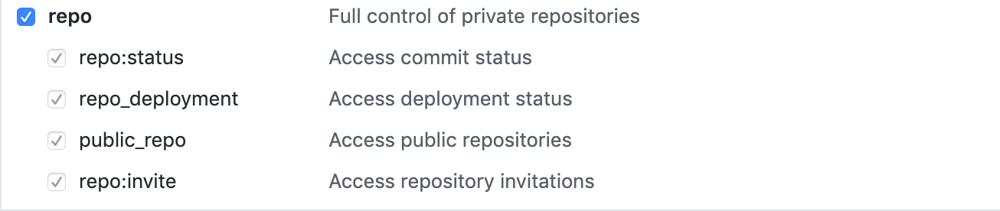
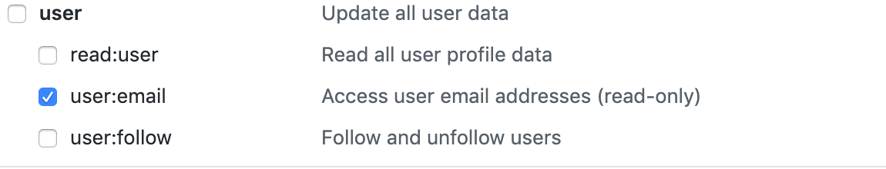
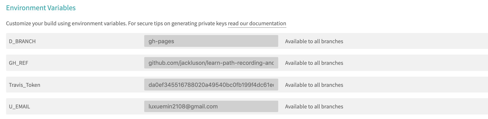

# Travis 认识及实践


### 配置 access-token

因为Travis 在自动部署的时候，需要对github的仓库进去PUSH 操作，所以需要对Travis进去授权，Github提供了Access Token的方式，可以授权给Travis CI

新建token的位置：`GitHub->Settings->Developer Settings->Personal access tokens`。

勾选`repo`下的所有项，以及`user`下的`user:email`后，生成一个token，复制token值。





> 注意：这个token只有新建成功时候可以看到，复制，所以妥善保管好。当然也可以新建一个


### 配置**Travis**

在上一步得到token之后，就可以在Travis的仓库设置中设置环境变量，如下所示




### `.travis.yml` 文件

在根目录下新建`.travis.yml `文件

```yaml
language: node_js

node_js:
  - 12.13.1

cache:
  directories:
    - node_modules #缓存依赖


# S: Build Lifecycle
install:
  - npm i

script:
  - npm run build
#after_script前5句是把部署分支的.git文件夹保护起来，用于保留历史部署的commit日志，否则部署分支永远只有一条commit记录。
#命令里面的变量都是在Travis CI里配置过的。
after_script:
  - cd dist
  - git config user.name "${U_NAME}"
  - git config At-Cost Domain Pricing - Domain Cost Club "${U_EMAIL}"
  - git add .
  - git commit -m ":construction_worker:- Build & Deploy by Travis CI"
  - git push --force --quiet "https://${Travis_Token}@${GH_REF}" master:${D_BRANCH}
# E: Build LifeCycle

# 只有指定的分支提交时才会运行脚本
branches:
  only:
    - master

```

> **注：** 上述用到了环境变量，Travis_Token放在@符号之前，以https方式


### :books: Reference

- [持续集成服务 Travis CI 教程](http://www.ruanyifeng.com/blog/2017/12/travis_ci_tutorial.html)

- [官方文档](https://docs.travis-ci.com/)


###  
