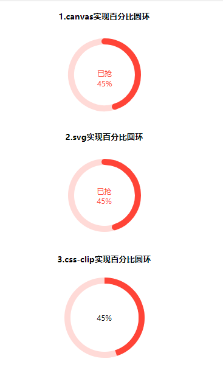

# 圆环百分比三种实现方式汇总

## 前言

> 如下图所示,圆环百分比的效果在平常业务中还是有时候需要用到的(比如抢优惠券),借此总结一个几种实现圆环百分比做法



## 实现方式

### 1. canvas实现

- html部分代码

```html
<canvas id="circle" height="132px" width="132px">
</canvas>
```

- js部分代码

```css
// 1.canvas实现
  circle()
  function circle() {
      var canvas = document.getElementById('circle');
      var ctx = canvas.getContext("2d");

      /*填充文字*/

      ctx.font = "12px Microsoft YaHei";
      /*文字颜色*/
      ctx.fillStyle = '#FF4437';
      /*文字内容*/
      var insertContent = '已抢';
      var text = ctx.measureText(insertContent);
      /*插入文字，后面两个参数为文字的位置*/
      /*此处注意：text.width获得文字的宽度，然后就能计算出文字居中需要的x值*/
      ctx.fillText(insertContent, (132 - text.width) / 2, 68);

      /*填充百分比*/
      var ratioStr = percent + '%';
      var text = ctx.measureText(ratioStr);
      ctx.fillText(ratioStr, (132 - text.width) / 2, 85);

      /*开始圆环*/
      var circleObj = {
          ctx: ctx,
          /*圆心*/
          x: 66,
          y: 66,
          /*半径*/
          radius: 55,
          /*环的宽度*/
          lineWidth: 10
      }
      /*有色的圆环*/
      /*从-90度的地方开始画*/
      circleObj.startAngle = - Math.PI * 2 * 90 / 360;
      /*从当前度数减去-90度*/
      circleObj.endAngle = Math.PI * 2 * (percent / 100 - 0.25);
      circleObj.color = '#FF4437';
      drawCircle(circleObj);
      /*灰色的圆环*/
      /*开始的度数-从上一个结束的位置开始*/
      circleObj.startAngle = circleObj.endAngle;
      /*结束的度数*/
      circleObj.endAngle = Math.PI * 2;
      circleObj.color = '#ff453833';
      drawCircle(circleObj);

  }
  /*画曲线*/
  function drawCircle(circleObj) {
      var ctx = circleObj.ctx;
      ctx.beginPath();
      ctx.arc(circleObj.x, circleObj.y, circleObj.radius, circleObj.startAngle, circleObj.endAngle, false);
      //设定曲线粗细度
      ctx.lineWidth = circleObj.lineWidth;
      //给曲线着色
      ctx.strokeStyle = circleObj.color;
      //连接处样式
      ctx.lineCap = 'round';
      //给环着色
      ctx.stroke();
      ctx.closePath();
  }
```


### 2.svg实现

- HTML部分代码

```html
<div class="circle-wrapper">
      <svg xmlns="http://www.w3.org/200/svg" height="100%" width="100%">
          <circle class="circle-full" cx="66" cy="66" r="55" fill="none" stroke="#FF4437" stroke-width="10" stroke-linecap="round"></circle>
          <circle class="circle-detail" cx="66" cy="66" r="55" fill="none" stroke-width="10" stroke-linecap="round" stroke="#FF4437" stroke-dasharray="0,10000"></circle>
      </svg>
      <p class="coupon-num had-percent">
        已抢
        <span class="percent">45%</span>
      </p>
  </div>
```

- css部分代码

```css
.circle-wrapper {
      display: inline-block;
      position: relative;
      width: 132px;
      height: 132px;
      margin-bottom: 8px;
}
 .circle-wrapper .coupon-num {
    width: 36px;
    position: absolute;
    top: 50%;
    left: 50%;
    margin-left: -18px;
    color: #FF4437;
    font-size: 12px;
    margin-top: -15px;
   }
   .circle-full {
    opacity: .2;
   }
   .circle-detail {
    -webkit-transform-origin: 66px 66px;
    transform-origin: 66px 66px;
    -webkit-transform: rotate(-90deg);
    transform: rotate(-90deg);
    stroke: #FF4437;
  }
```

- js部分代码

```js
  //2.svg实现
  var cricleEl = document.querySelector('.circle-detail')
  var percentEl = document.querySelector('.percent')
  var circleLength = Math.floor(2 * Math.PI * 55);
  rotateCircle(cricleEl,percent)
  percentEl.innerHTML =percent + '%'
  function rotateCircle (el,percent) {
    var val = parseFloat(percent).toFixed(0);
    val = Math.max(0,val);
    val = Math.min(100,val);
    el.setAttribute("stroke-dasharray","" + circleLength * val / 100 + ",10000");
  }
```

### 3.css-clip实现

- html部分代码

```html
<div class="box">
    <div class="clip">
        <div class="left"></div>
        <div class="right width-none"></div>
    </div>
    <div class="num">
    </div>
</div>
```

- css部分代码

```css
 .box{
      display: inline-block;
      width: 132px;
      height: 132px;
      position: relative;
      background-color: #ffdad7;
      border-radius: 50%;
  }
  .num{
      position: absolute;
      top: 50%;
      left: 50%;
      background: #fff;
      border-radius: 50%;
      width: 112px; 
      height: 112px;
      transform: translate(-50%, -50%);
      text-align: center;
      line-height: 112px;
      font-size: 12px;
  }
  .clip{
      width: 132px;
      height: 132px;
      position: absolute;
      border: 10px solid #ffdad7;
      border-radius: 50%;
      clip: rect(0, 132px, 132px, 66px);
  }
  .left{
      width: 132px;
      height: 132px;
      position: absolute;
      border: 10px solid #FF4437;
      border-radius: 50%;
      clip: rect(0 66px 132px 0);
      top: -10px;
      left: -10px;
  }
  .right{
      width: 132px;
      height: 132px;
      position: absolute;
      border: 10px solid #FF4437;
      border-radius: 50%;
      clip: rect(0 132px 132px 66px);
      top: -10px;
      left: -10px;
  }
  .width-none{
      width: 0;
  }
  .auto{
      clip: auto;
  }
```

- js部分代码

```js

// 3.css-clip实现方式
  let clip = document.querySelector('.clip'),
  left = document.querySelector('.left'),
  right = document.querySelector('.right'),
  num = document.querySelector('.num');
// 
  let loop = setTimeout(() => {
      if(percent >= 100){
          percent = 0;
          right.classList.add('width-none');
          clip.classList.remove('auto');
      } else if(percent > 50){
          right.classList.remove('width-none');
          clip.classList.add('auto');
      }
      // rotate++;
      left.style.transform = 'rotate('+ 3.6*percent + 'deg)';
      num.innerHTML = `${percent}%`
  },100)
  
```

## 小结

> 结合兼容性,代码简洁性,三种方式各有优势。结合兼容性,我青睐使用svg实现
>
> [原文地址](https://jackluson.github.io/learn-path-recording-and-coding/effect/percent-ring.html)

> 不如自己动手试试

<p class="codepen" data-height="265" data-theme-id="0" data-default-tab="js,result" data-user="jackluson" data-slug-hash="NVOogb" style="height: 265px; box-sizing: border-box; display: flex; align-items: center; justify-content: center; border: 2px solid; margin: 1em 0; padding: 1em;" data-pen-title="圆环百分比的实现(三种方法比较)">
  <span>See the Pen <a href="https://codepen.io/jackluson/pen/NVOogb/">
  圆环百分比的实现(三种方法比较)</a> by lumoumou (<a href="https://codepen.io/jackluson">@jackluson</a>)
  on <a href="https://codepen.io">CodePen</a>.</span>
</p>
<script type="application/javascript"  async src="https://static.codepen.io/assets/embed/ei.js"></script>

---


## REFERENCE

- [CSS clip:rect矩形剪裁功能及一些应用介绍](https://www.zhangxinxu.com/wordpress/2011/04/css-clip-rect/)
- [clip实现圆环进度条](https://juejin.im/post/5a7c6d0d6fb9a063395c5f59)

