# 你所需要知道 DNS 劫持--web 安全篇

### 一、前言

> 背景：在一次 CTO 面试过程中，突然问起了我，平时开发过程中有没有遇到过 DNS 劫持的情况，啊，啥是 DNS 劫持？脑子突然蹦出所有的 DNS 的知识点，回忆之前工作遇到的问题，很凌乱，最终回答不知道。努力学习的我回来抓紧做功课，于是才有了这篇文章。
>
> DNS 劫持（DNS Hijacking）：又被称为域名劫持，DNS 重定向（DNS direaction）,是一种 DNS 攻击方式。即是 DNS 查询没有得到正确的解析，以致引导 user 访问到恶意的网站，从而窃取用户隐私，或者进行某些恶意的操作。

### DNS 劫持:vs:HTTP 劫持

开始正式介绍 DNS 劫持之前，先与 HTTP 劫持做一个比较，可能有助于有些同学对下文更容易理解更深入一点。

DNS 劫持现象：你输入一个 google.com 网址，出来的是百度的页面

HTTP 劫持现象：访问着 github 的页面，右下角出现了一个格格不入的广告弹窗

**好比：**

> DNS 劫持是你想去机场的时候，把你给丢到火车站。
> HTTP 劫持是你去机场途中，有人给你塞小广告、

### 二、什么是 DNS

> 理解 dns 劫持之前，先来回忆一下 dns 是如何工作的

DNS(Domin Name System or Domain Name Service)，域名解析系统(服务) ：在网络世界中，服务器（server）是通过 IP 地址标识的，网站（client）通过端口 80/443 （http/https）可以访问，因此有些网站（没有限制 IP 访问的）直接通过 ip 地址也是可以访问的。DNS 的责任就是将难以记忆的 IP 地址**映射**成对用户友好，易于记忆的域名。有了这样的映射表（:notes:注意，不是一对一关系，一个服务器（IP）可以对应多个域名），这样用户可以直接输入域名就可以通过 DNS 服务器查到对应的服务器 IP 地址。

> 比如我们在终端命令 dig `https://www.tungee.com/`(探迹科技)就可以看到对应的服务器 IP(49.99.141.230)了
>
> 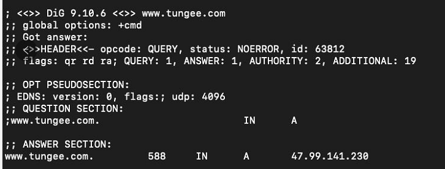

从`www.tungee.com` 到 `49.99.141.230`的过程就叫做域名解析，域名解析需要由专门的域名解析服务器来完成

> 注：一般的网站会选择放在虚拟主机，且在主机上放置了很多个网站，而每个网站绑定 1 个或以上域名。虽然主机上有多个站点，但当用户访问某个站点时，服务器会根据 http 报文信息（域名），访问对应站点的部署目录，从而实现一台服务器上配置多个站点，即使有多个网站，也不会相互干扰。但使用 IP 访问，主机不知道用户访问的具体目录，请求便会出现异常情况。）

### 三、DNS 解析原理

#### 1.查询步骤

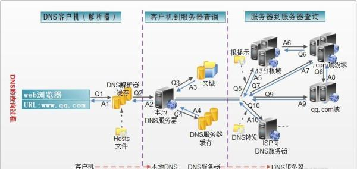

从上图（图片来源网络，如侵权请联系删）可以大概看出大体的步骤：

1. 客户端（浏览器）发送一个域名（例如`www.tungee.com`）解析请求，先检查浏览器缓存中有没有对应域名解析的 IP 地址，如果有直接返回。

2. 如果用户浏览器缓存没有查到的话，会先到操作系统的 hosts 文件中查找（听说 ios 设备没有该步骤，待验证），有对应的域名 IP 地址的话直接返回。

3. 如果本地 hosts 文件没有查到，会向外网的本地区域名服务器（Local DNS）发起查询请求，本地服务器收到请求之后，会先查询本地缓存，如果有的话会直接返回。

   > 本地区域名服务器通常性能都会很好，它们一般都会缓存域名解析结果，当然缓存时间是受域名的失效时间控制的，一般缓存空间不是影响域名失效的主要因素。大约 90%的域名解析都到这里就已经完成了，所以 LDNS 主要承担了域名的解析工作。

4. 如果 LDNS 缓存没有结果的话，会向跟域名服务器发起请求，根域名（Root Server）返回来的是一个所查询域（根的子域，例如`.com`）的主域名服务器（gTLD Server）的地址，gTLD 是国际顶级域名服务器，如.com，.cn、.org 等。听说全球只有 13 台左右。

5. 接着，本地服务器再向上一步返回来的域名服务器下发送请求。

6. 接受请求的 gTLD 服务器查找并返回此域名对应的 Name Server 域名服务器的地址，这个 Name Server 通常就是你注册的域名服务器，例如你在某个域名服务提供商申请的域名，那么这个域名解析任务就由这个域名提供商的服务器来完成。

7. 得到了 Name Server 服务器地址之后，Local DNS 再次向 Name server 服务器发送请求，Name Server 提供商是你申请的域名提供商，因此 Name Server 域名服务器会查询存储的域名和 IP 的映射关系表，正常情况下都根据域名得到目标 IP 记录。

8. Local DNS 得到了`www.tungee.com`对应的 ip 地址与 TTL 值（Time to live 的缩写，也就是上面的 588 这个值）之后，会根据这 TTL 值缓存这个域名与 ip 的对应关系。

9. 最终把该 ip 地址返回给浏览器

#### 2.dig+域名 命令的输出解读

> 虽然最终只返回了一个 ip 地址，但是查询的过程还是非常复杂的，分多个步骤，利用 dig 命令（windows 下需要额外装 dig 工具）可以大概知道这个查询过程。

```shell
dig tungee.com
```

随后会出现以下几节信息

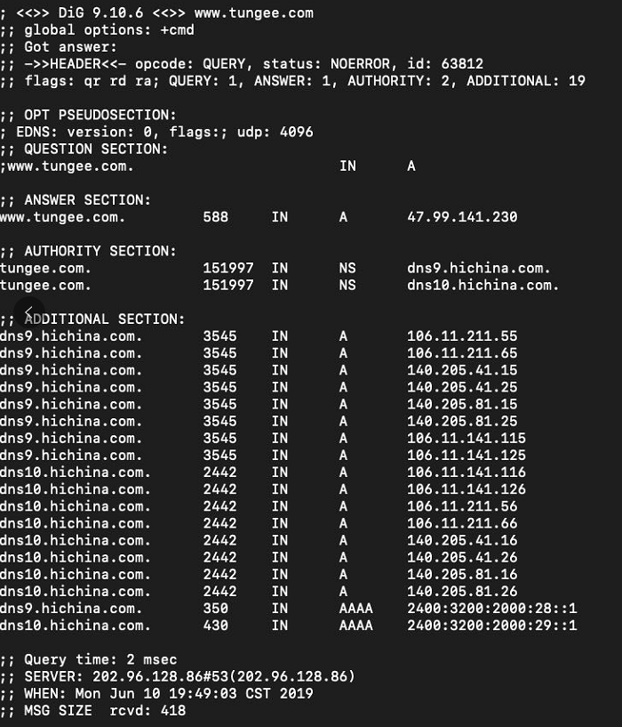

- 第一段是 dig 工具版本，查询参数和统计信息

  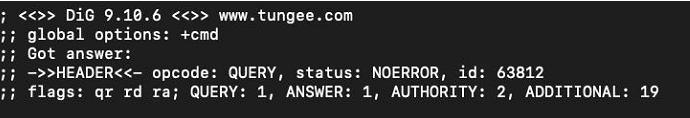

- 第二段是查询内容

  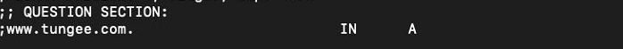

- 第三段是 DNS 服务器的答复

  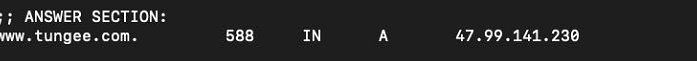

  > 上面结果显示，tungee 有 1 个 A 记录，即 1 个 IP 地址。
  > 588 是 TTL 值（Time to live 的缩写），表示缓存时间，即 588 秒之内不用重新查询。

- 第四段显示 tungee.com 的 NS 记录（Name Server 的缩写），即哪些服务器负责管理 tungee.com 的 DNS 记录

  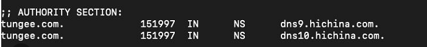

  > 上面结果显示 tungee.com 共有 2 条 NS 记录，即 2 个域名服务器，向其中任一台查询就能知道 tungee.com 的 IP 地址是什么。

- 第五段是上面 2 个域名服务器的 IP 地址，这是随着前一段一起返回的

  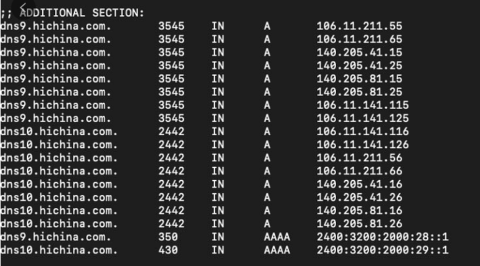

- 第六段是 DNS 服务器的一些传输信息

  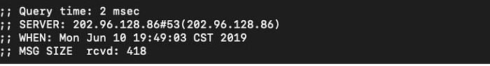

  > 上面结果显示，本机的 DNS 服务器是 192.168.1.253，查询端口是 53（DNS 服务器的默认端口），以及回应长度是 418 字节。

更多关于 dig 命令与解读，请可以看参考列表链接或者自行谷歌，百度。

#### 3.DNS 服务器

上面第六段截图中 you

```
；； SERVER: 202.96.128.86#53
```

上面这个就是当前电脑的 DNS 服务器 ip 地址，这个 DNS 服务器的 ip 地址是自动分配（当然也可以自定义）的，当用户联网时，宽带运营商会分配一个 DNS 服务器，这个服务器通常情况下时最快，距离最近的服务器。

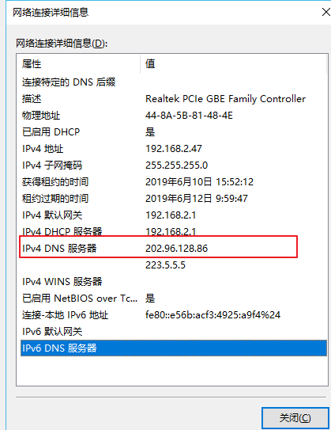

> 上图就是 window 电脑的当前电脑分配的 DNS 服务器，Mac，Linux 系统 DNS 服务器 IP 地址保存在/etc/resolv.conf 文件中

如果用户因为某些网络问题，安全问题需要手动设置 DNS 服务器也是可以的

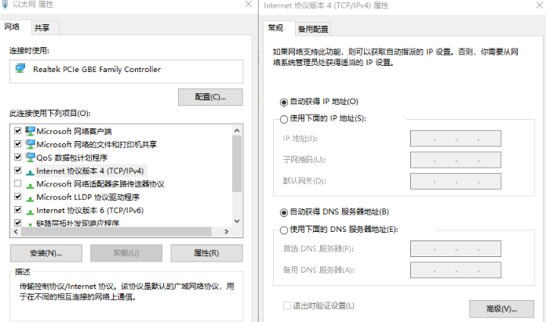

> 上图就是 window 设置 DNS 服务器页面，关于手动设置公共 DNS 服务器 IP 地址可以阅读[公共 DNS 哪家强？](https://www.zhihu.com/question/32229915)

#### 4.域名的层级

从查询的步骤来看,域名是有层级的。

> 举个例子来说,`www.tungee.com` 真正的域名是`www.tungee.com.root`
>
> 因为所有的域名的根域名都是`.root` 所以默认都是省掉的

根域名的下一级叫做‘顶级域名’（top-level domain），比如`.com` `.net`

再下一级则是"次级域名"（second-level domain），比如`www.tungee.com`里面的`tungee`,这级域名用户是可以注册的。

再下一级是主机名（host），比如`www.tungee.com`里面的 www，又称为"三级域名"，这是用户在自己的域里面为服务器分配的名称，是用户可以任意分配的。

> 主机名.次级域名.顶级域名.根域名
>
> `www.tungee.com.root`

#### 5.分级查询的实例演示

我们已经介绍过了域名的层级，那是具体怎么样分级查询的呢

我们可以利用 dig 命令来显示每一级的域名记录查询过程。

```shell
dig +trace www.tungee.com
```

每一级域名都有自己的 NS 记录，NS 记录指向（后面跟着）就是该级的域名服务器，这些服务器知道下一级域名的各种记录（类比电话簿，记录着域名与 ip 地址映射关系）。

大致分级查询的过程如下：

- **首先本地 DNS 服务器向根域名发起请求，**
- **"根域名服务器"查到"顶级域名服务器"的 NS 记录和 A 记录（IP 地址）**
- **从"顶级域名服务器"查到"次级域名服务器"的 NS 记录和 A 记录（IP 地址）**
- **从"次级域名服务器"查出"主机名"的 IP 地址**

> 仔细琢磨，你就会发现本地 DNS 服务器怎么知道根域名的 ip 地址呢？
>
> 回答是根域名服务器目前全球一共只有十三台，从下面截图可以看出从`a.root-servers.net.`到`m.root-servers.net.`,它们对应的 ip 地址，已经内置在本地 DNS 服务器中了

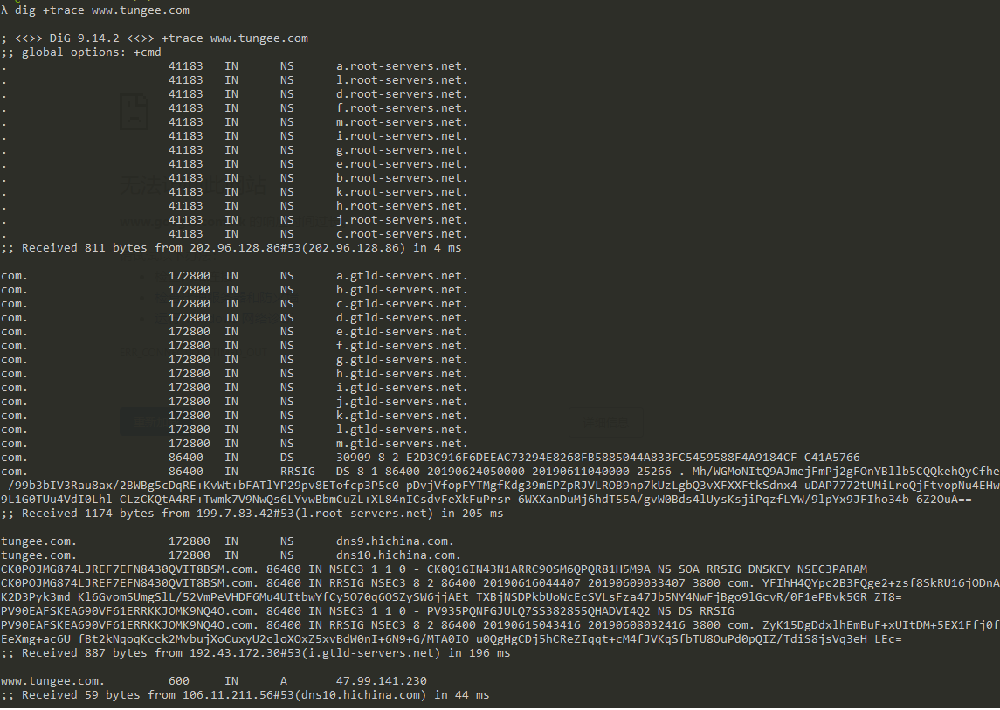

> 上面的截图大概分成 4 段

**1.第一段**

> 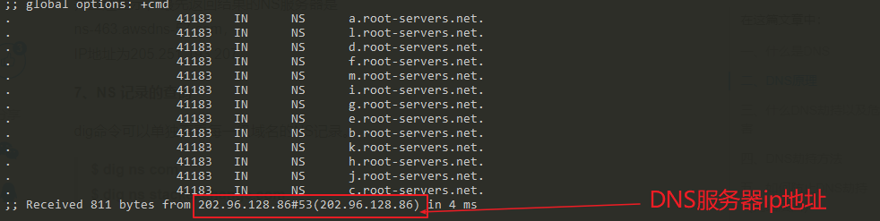
>
> 根据内置的根域名服务器 IP 地址，DNS 服务器向所有这些 IP 地址发出查询请求，询问`www.tungee.com`的顶级域名服务器 com 的 NS 记录。

**2.第二段**

> 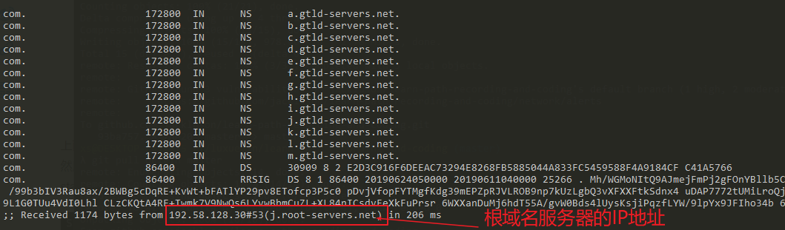
>
> 接着向`j.root-server.net`返回来的 13 条`.com`域名的 NS 记录，同时也返回来每一条的 IP 地址（这里并不是每一条都显示），然后 DNS 再向这些顶级域名服务器发出查询请求。查询 tungee.com 次级域名的 NS 记录

**3.第三段**

> 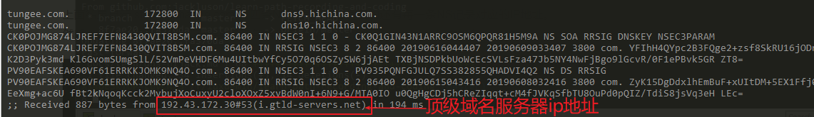
>
> 同样，最先返回来的结果的是`i.gtld-server.net`域名服务器查询的结果，分别有`2`条 NS 记录，同时返回来每一条 NS 记录对应的 IP 地址，DNS 服务器再向以上两台 NS 服务器查询 tungee.com 的主机 ip 地址

**4.第四段**

> 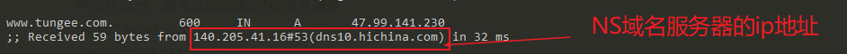
>
> 最先返回来的`dns10.hichina.com`这个 NS 域名服务器的查询结果（A,Address，返回来的 ip 地址记录），得到 ip 地址之后，DNS 服务器缓存起来，返回来浏览器

### 四、DNS 劫持的方法以及防范

从上面可以知道 DNS 解析原理，解析步骤，在 dns 解析过程中，有哪一环节出现问题的话，都可能会导致 DNS 解析错误，导致客户端（浏览器）得到一个假的 ip 地址，从而引导用户访问到这个冒名顶替，恶意的网站。

**DNS 劫持带来的危害：**

1.钓鱼诈骗

2.网上购物支付安全

3.泄露个人隐私

4.轻则影响网速，重则不能上网

#### 1.DNS 劫持的方法

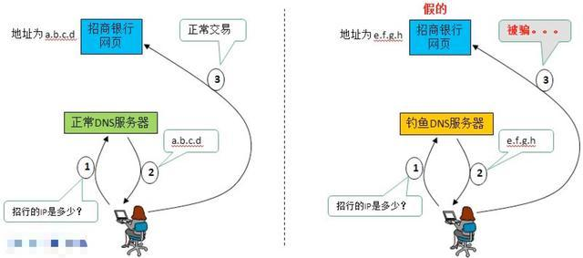

**下面大概说几种 DNS 劫持方法**

**1.本机 DNS 劫持**

攻击者通过某些手段使用户的计算机感染上木马病毒，或者恶意软件之后，恶意修改本地 DNS 配置，比如修改本地 hosts 文件，缓存等

**2. 路由 DNS 劫持**

很多用户默认路由器的默认密码，攻击者可以侵入到路由管理员账号中，修改路由器的默认配置

**3.攻击 DNS 服务器**

直接攻击 DNS 服务器，例如对 DNS 服务器进行 DDOS 攻击，可以是 DNS 服务器宕机，出现异常请求，还可以利用某些手段感染 dns 服务器的缓存，使给用户返回来的是恶意的 ip 地址

**4.......**

#### 2.DNS 的防范

> 就这上面的劫持方法，说几种方法手段

**1.加强本地计算机病毒检查，开启防火墙等，防止恶意软件，木马病毒感染计算机**

**2.改变路由器默认密码，防止攻击者修改路由器的 DNS 配置指向恶意的 DNS 服务器**

**3.企业的话可以准备两个以上的域名，一旦一个域名挂掉，还可以使用另一个**

**4.用 HTTP DNS 代替 Local DNS**

> 对于 DNS 劫持，往往单靠个人设置很难解决，如果已经出现了劫持现象的话，对电脑进去杀毒，清理，检查 hosts 文件，核查网络设置的 DNS 配置（可以使用写公共的 DNS 服务器）

最后，查了很多资料才写了这篇文章，补充自己这方面的知识点，后面考虑继续写关于 web 安全--ddos 攻击，xss，csrf 等

###

### Reference

> 下面是参考，补充文章，感谢以下文章作者提供的思路

- [How to Prevent DNS Hijacking](https://antivirusinsider.com/prevent-dns-hijacking/)
- [What is a DNS hijacking / redirection attack](https://www.imperva.com/learn/application-security/dns-hijacking-redirection/)
- [黑客技术？没你想象的那么难！——dns 劫持篇](https://cloud.tencent.com/developer/article/1197474)
- [深入理解 Http 请求、DNS 劫持与解析](https://juejin.im/post/59ba146c6fb9a00a4636d8b6)
- [如何使用 Dig 命令在 Linux 中查询 DNS 记录](https://www.sysgeek.cn/linux-dig/)
- [从 dig 查询结果看 DNS 的 A 记录和 NS 记录](https://my.oschina.net/u/1382972/blog/340197)
- [TCP/UDP 端口列表](https://zh.wikipedia.org/wiki/TCP/UDP%E7%AB%AF%E5%8F%A3%E5%88%97%E8%A1%A8)
