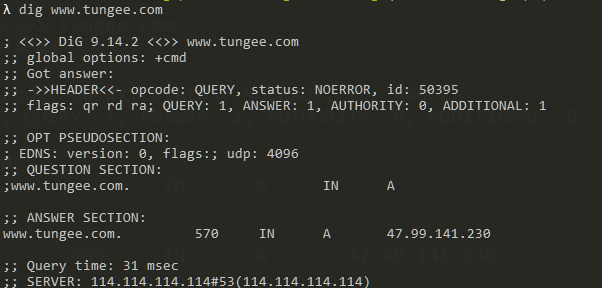

# 你所需要知道DNS 劫持--web安全篇（1）

### 前言

> 背景：在一次CTO面试过程中，突然问起了我，平时开发过程中有没有遇到过DNS劫持的情况，啊，啥是DNS劫持？脑子突然蹦出所有的DNS的知识点，回忆之前工作遇到的问题，很凌乱，最终回答不知道。努力学习的我回来抓紧做功课，于是才有了这篇文章。
>
> DNS劫持（DNS Hijacking）：又被称为域名劫持，DNS重定向（DNS direaction）,是一种DNS攻击方式。即是DNS查询没有得到正确的解析，以致引导user访问到恶意的网站，从而窃取用户隐私，或者进行某些恶意的操作。

### DNS劫持:vs:HTTP劫持 

开始正式介绍DNS劫持之前，先与HTTP劫持做一个比较，可能有助于有些同学对下文更容易理解更深入一点。

DNS劫持现象：你输入一个google.com网址，出来的是百度的页面

HTTP劫持现象：访问着github的页面，右下角出现了一个格格不入的广告弹窗

**好比：**

> DNS劫持是你想去机场的时候，把你给丢到火车站。
> HTTP劫持是你去机场途中，有人给你塞小广告、

### 什么是DNS

> 理解dns劫持之前，先来回忆一下dns是如何工作的 

DNS(Domin Name System or Domain Name Service)，域名解析系统(服务) ：在网络世界中，服务器（server）是通过IP 地址标识的，网站（client）通过端口80/443 （http/https）可以访问，因此有些网站（没有限制IP访问的）直接通过ip地址也是可以访问的。DNS的责任就是将难以记忆的IP地址**映射**成对用户友好，易于记忆的域名。有了这样的映射表（:notes:注意，不是一对一关系，一个服务器（IP）可以对应多个域名），这样用户可以直接输入域名就可以通过DNS 服务器查到对应的服务器IP地址。

> 比如我们在终端命令 dig `https://www.tungee.com/`(探迹科技)就可以看到对应的服务器IP(49.99.141.230)了
>
> 
>
> 

从`www.tungee.com` 到 `49.99.141.230`的过程就叫做域名解析，域名解析需要由专门的域名解析服务器来完成

> 注：一般的网站会选择放在虚拟主机，且在主机上放置了很多个网站，而每个网站绑定1个或以上域名。虽然主机上有多个站点，但当用户访问某个站点时，服务器会根据http报文信息（域名），访问对应站点的部署目录，从而实现一台服务器上配置多个站点，即使有多个网站，也不会相互干扰。但使用IP访问，主机不知道用户访问的具体目录，请求便会出现异常情况。）

### Reference 

- [How to Prevent DNS Hijacking](https://antivirusinsider.com/prevent-dns-hijacking/)

- [What is a DNS hijacking / redirection attack](https://www.imperva.com/learn/application-security/dns-hijacking-redirection/)
- [黑客技术？没你想象的那么难！——dns劫持篇](<https://cloud.tencent.com/developer/article/1197474>)
- [深入理解Http请求、DNS劫持与解析](<https://juejin.im/post/59ba146c6fb9a00a4636d8b6>)